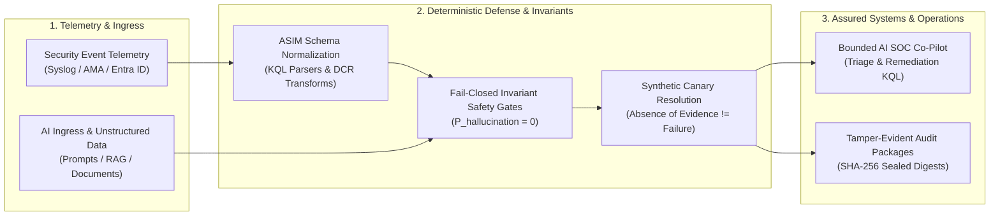

# Surya · Cybersecurity Architect & AI Systems Nerd 🛡️🤖

```text
===================================================================================================
[SYSTEM_TELEMETRY]: ONLINE  |  [CREDENTIALS]: CISSP · ISC²  |  [PARADIGM]: FAIL-CLOSED DETERMINISTIC
[CORE_VECTORS]   : Microsoft Sentinel · KQL · LLM Red Teaming · Zero Trust · FDE-21 Operating Model
===================================================================================================
```

> *"If an AI security control relies on an LLM not hallucinating without an invariant verification gate, it is not a defense — it is an unauthenticated vulnerability."*  
> **Philosophy: Deterministic verification > Stochastic optimism.**

---

### 🔬 The Intersection: Security Architecture × AI Engineering

I operate at the convergence of **enterprise cloud security architecture** and **deterministic AI systems engineering**. My work bridges formal security frameworks (CISSP, Zero Trust, NIST CSF, Microsoft Cloud Security Benchmark) with hands-on systems programming — designing high-fidelity KQL detection engines, LLM threat boundaries, and fail-closed state machines.



---

### 🛡️ Threat Modeling & Technical Weaponry

<div align="center">

| Domain | Tactical Focus & Defense Patterns | Stack & Standards |
| :--- | :--- | :--- |
| **Cloud & SIEM Architecture** | Multi-hop telemetry assurance, ASIM parsers, high-throughput log economics (FinOps), Zero Trust landing zones | `Microsoft Sentinel` `KQL` `Defender for Cloud` `Entra ID` `Azure Policy` |
| **Detection Engineering** | Threat hunting, adversary emulation detection, KQL ASTs, lateral movement & identity compromise rules | `MITRE ATT&CK` `KQL Analytics` `Sigma` `Sysmon` `XPath` |
| **AI / LLM Threat Defense** | Prompt injection defense, system prompt extraction resistance, tool-call taint analysis, RAG poisoning mitigation | `OWASP LLM Top 10` `Guardrails` `FastAPI` `Python` `LangChain` |
| **Safety-Critical Systems** | Bitemporal ledgers, fail-closed state machines, GxP auditable workflows, 21-state FDE delivery | `FDE-21` `Deterministic State Machines` `SHA-256 Digest Verification` |
| **Security Automation (SOAR)** | Event-driven incident remediation, automated identity quarantine, dynamic canary dispatching | `Logic Apps` `PowerShell 7` `Python 3.12` `Terraform` `Bicep` |

</div>

---

### 🧪 Flagship War Rooms & Systems

```
┌─────────────────────────────────────────────────────────────────────────────────────────────────┐
│ FEATURED ARCHITECTURES & REPOSITORIES                                                          │
└─────────────────────────────────────────────────────────────────────────────────────────────────┘
```

#### 🛡️ [Sentinel-Log-Validation-Agent](https://github.com/86sunbot/Sentinel-Log-Validation-Agent)
> **Deterministic Log Onboarding Assurance Platform & AI SOC Co-Pilot**  
> *Stack: Python 3.11+ · KQL · FastAPI · Microsoft Sentinel · ASIM*
- **130+ Deterministic Unit Tests**: Evaluates log onboarding health, latency percentiles ($P_{95}$), and field population without probabilistic LLM guessing.
- **Canary Resolution**: Solves *"Absence of evidence $\neq$ evidence of failure"* using synthetic correlation canary tokens for quiet event streams.
- **Three-Way Reconciliation**: Automatically audits Enterprise Asset Inventories vs. Azure Control Plane vs. active Data Plane telemetry to catch silent attrition and shadow devices.
- **FinOps Sizing & ASIM Scoring**: Models Analytics vs. Basic Logs cost optimization and scores telemetry against Sentinel ASIM schemas.
- **Interactive SOC Workbench**: Local FastAPI assurance dashboard with real-time hop-by-hop pipeline visibility and SHA-256 tamper-evident audit packages.

#### 🧬 [FDE-Final-Capstone](https://github.com/86sunbot/FDE-Final-Capstone) / [AI-FDE-Capstone-AG](https://github.com/86sunbot/AI-FDE-Capstone-AG)
> **21-Stage AI FDE Operating Model: Cell & Gene Therapy (CGT) Orchestration**  
> *Stack: Python · SQLite · Bitemporal Ledgers · Deterministic State Machines*
- Replaced a fragmented fail-open legacy environment with a **deterministic fail-closed orchestration layer** and bounded AI exception triage.
- Implements all 21 stages of the AI Forward Deployed Engineering operating model: bitemporal event sourcing, GxP boundary isolation, and immutable audit trails.

#### 🏥 [caldera-monitoring-triage](https://github.com/86sunbot/caldera-monitoring-triage)
> **GxP-Auditable Clinical Monitoring Report Triage Engine**  
> *Stack: TypeScript · Python · Google AI Studio Applet · Vite*
- **Verbatim Attribution Gate**: Surfaces operational observations with immutable `document_id`, `page_number`, and `verbatim_sentence` attribution.
- **Curveball Resilience**: Handles partial upstream outages with statutory completeness warnings and strict denominator disclosures (`reports_retrieved` / `reports_expected`).

#### 🔍 [sentinel-detection-engineering](https://github.com/86sunbot/sentinel-detection-engineering)
> **Production-Grade KQL Detection Rules Mapped to MITRE ATT&CK**  
> *Stack: KQL · Microsoft Sentinel · MITRE ATT&CK Enterprise*
- Coverage for Identity Attacks (credential dumping, anomalous Entra ID sign-ins), Lateral Movement, and Cloud Persistence mechanisms.

#### 🤖 [ai-security-lab](https://github.com/86sunbot/ai-security-lab)
> **LLM Threat Models, Adversarial Red Teaming & Invariant Guardrails**  
> *Stack: Python · OWASP Top 10 for LLMs · Prompt Injection Defense*
- Research on indirect prompt injection vectors, context escaping techniques, and hardening Azure OpenAI endpoints.

#### 🏗️ [azure-security-framework](https://github.com/86sunbot/azure-security-framework)
> **Cloud Security Architecture & Zero Trust Landing Zones**  
> *Stack: Terraform · Bicep · Azure Policy · MCSB*
- Reference designs aligned with the Microsoft Cloud Security Benchmark (MCSB) and Cloud Adoption Framework (CAF).

---

### ⚡ Technical Spec & Toolbox

```text
SIEM & SOC        : Microsoft Sentinel, Log Analytics, Azure Monitor, KQL, ASIM, Defender XDR
IDENTITY & ACCESS : Entra ID, Conditional Access, PIM, Zero Trust, RBAC, OAuth2 / OIDC
AI & ADVERSARIAL  : OWASP Top 10 for LLM, AI Red Teaming, Prompt Defense, LangChain, FastAPI
SYSTEMS & IAAC    : Python 3.12, PowerShell, TypeScript, Terraform, Bicep, GitHub Actions, Docker
ASSURANCE & GOV   : CISSP (ISC²), NIST CSF 2.0, ISO 27001, MITRE ATT&CK, GxP / Bitemporal Audit
```

---

### 📊 Cryptographic Identity & Network

<p align="left">
  <a href="https://www.linkedin.com/in/surya-ps-cissp-a5a097160/"></a>
  <a href="https://github.com/86sunbot"></a>
  
  
</p>

```text
[EOF] ─── "Security is not a product. It is an architecture, a proof system, and a discipline."
```
