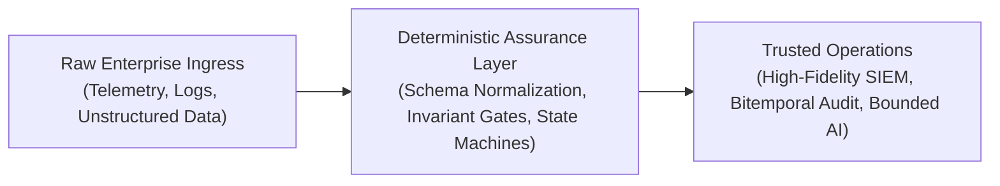

# Surya

**Cybersecurity Architect · AI Systems & Detection Engineering**  
*CISSP · Microsoft Sentinel & Azure Cloud · Forward Deployed Engineering*

---

> *"The most vulnerable point in modern software is where probabilistic AI meets mission-critical invariants. I design the architectures and deterministic guardrails that make those systems hold."*

---

### Overview

I am a Cybersecurity Architect working at the intersection of **enterprise cloud security** and **deterministic AI engineering**. 

My focus is on systems where failure is not an option: safety-critical workflows, enterprise SIEM deployments, and AI integrations in regulated domains. Rather than relying on optimistic assumptions or unverified model outputs, I build architectures anchored in **first principles**: fail-closed state machines, verifiable audit trails, high-fidelity detection engineering, and Zero Trust boundaries.

---

### Core Areas of Focus

* **Cloud Security Architecture & Zero Trust**  
  Designing resilient Azure landing zones, identity perimeters (Entra ID, PIM, Conditional Access), and governance baselines aligned with the Microsoft Cloud Security Benchmark and CISSP domains.

* **Detection Engineering & Security Analytics**  
  Building high-signal, low-noise detection suites in Microsoft Sentinel using KQL ASTs and ASIM schemas, mapped directly to MITRE ATT&CK tactics (identity compromise, lateral movement, persistence).

* **AI Systems Assurance & Forward Deployed Engineering**  
  Applying structured FDE operating models to bridge complex enterprise datasets with AI. Eliminating hallucination risk through invariant verification gates, bitemporal history, and cryptographic audit packages.

---

### Selected Case Studies & Systems

#### 🌐 [Cell & Gene Therapy (CGT) Orchestration](https://github.com/86sunbot/FDE-Final-Capstone)
*Public Capstone · 21-Stage AI FDE Operating Model*
* Replaced an inherited, fail-open legacy environment with a **deterministic, fail-closed orchestration engine** for patient-to-batch tracking.
* Implemented bitemporal state reconciliation, explicit three-state verification (`satisfied` / `not-satisfied` / `unknown`), and immutable audit trails across seven organizational personas.

#### 🌐 [Clinical Monitoring Report Triage](https://github.com/86sunbot/caldera-monitoring-triage)
*Public System · GxP-Compliant Triage Engine · Live Interactive Applet*
* Designed an operational review pipeline for clinical monitoring reports with **zero-hallucination guarantees** via verbatim, sentence-level source attribution (`document_id`, `page_number`, `verbatim_sentence`).
* Engineered denominator-aware degradation gates to maintain regulatory compliance even during partial upstream service outages.

#### 🌐 [Forward Deployed Engineering Lab](https://github.com/86sunbot/fde-lab)
*Public Research & Benchmark Repository*
* Published an in-depth comparative benchmark: *[Enterprise AI/DR: Microsoft Security vs. CrowdStrike Falcon](https://github.com/86sunbot/fde-lab/blob/main/microsoft_vs_crowdstrike_ai_dr_guide.md)*, evaluating signal fidelity, data lake economics, and AI triage efficacy.
* Includes automated deployment pipelines and testing harnesses for Sentinel analytics use cases.

---

### Enterprise & Proprietary Architecture

In addition to open-source contributions, my enterprise work includes:
* **Log Ingestion & Assurance Platforms**: Automated validation engines testing multi-hop telemetry health, ASIM compliance, and synthetic canary tokens in Microsoft Sentinel.
* **FinOps Log Sizing Engines**: Ingestion tier optimization models balancing Analytics vs. Basic log economics.
* **Adversarial AI Defense**: Threat modeling for LLMs, prompt injection boundary defenses, and secure Azure OpenAI landing zones.

---

### Connect & Credentials

* **Credentials**: CISSP (ISC²) · Microsoft Security Operations & Azure Cloud
* **LinkedIn**: [linkedin.com/in/surya-ps-cissp-a5a097160](https://www.linkedin.com/in/surya-ps-cissp-a5a097160/)
* **GitHub**: [@86sunbot](https://github.com/86sunbot)

---
*“Security is not a product. It is an architecture, a proof system, and a discipline.”*
